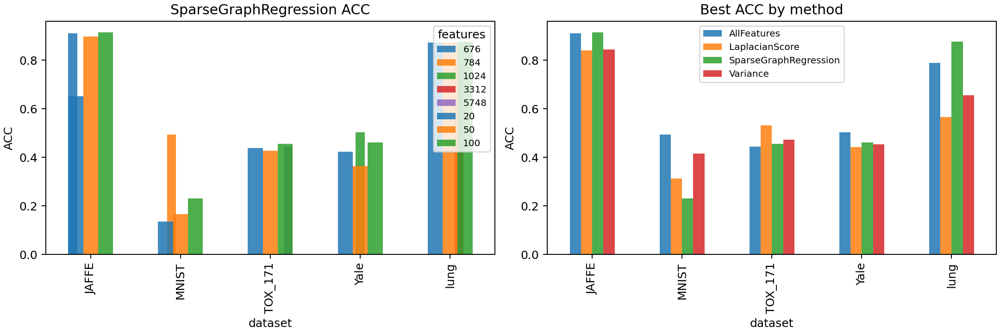

<div align="center">2026 SPRING GRADUATE MACHINE LEARNING COURSE PROJECT, VOL. 1, MAY 2026</div>

# 基于回归学习与流形结构保持的无监督特征选择

<div align="center">STEYZJ</div>

<div align="center">2026 春季研究生《机器学习》大作业</div>

**Abstract—** 高维数据广泛存在于人脸图像、手写数字识别和基因表达分析等机器学习任务中。冗余、无关或噪声特征不仅增加计算代价，也可能削弱聚类和分类模型对真实数据结构的刻画能力。针对无监督场景下缺少标签监督的问题，本文研究一种结合回归学习与流形结构保持的无监督特征选择方法。该方法首先根据样本局部邻域构造 kNN 相似图，并通过图谱嵌入生成无监督伪标签；随后建立带 $L_{2,1}$ 行稀疏正则和图拉普拉斯正则的回归模型，使特征权重在保持局部流形结构的同时产生行稀疏性；最后依据回归矩阵行范数对原始特征排序。本文在 JAFFE、MNIST、TOX_171、Yale 和 lung 五个课程给定数据集上进行实验，并以 KMeans 聚类的 ACC、NMI、ARI 和 Macro-F1 作为评价指标。实验结果表明，所实现方法在 JAFFE 和 lung 数据集上能够用较少特征达到或超过全特征聚类效果，其中 lung 数据集选择 100 个特征时 ACC 达到 0.8768，高于全特征的 0.7882。结果同时显示，该方法对近邻图质量、伪标签结构和正则参数较敏感，在 MNIST 等强空间结构图像数据上仍有改进空间。

**Index Terms—** Unsupervised feature selection, sparse regression, manifold learning, graph Laplacian, $L_{2,1}$-norm, spectral embedding.

## I. INTRODUCTION

随着数据采集与存储能力的提升，机器学习任务中的特征维度不断增大。图像数据可以将每个像素视为一个特征，基因表达数据可以将每个基因视为一个特征，遥感、医学和生物信息任务也常具有高维、小样本或噪声强的特点。高维特征虽然提供了丰富的信息来源，但同时带来三个典型问题：第一，大量冗余特征会显著增加模型训练与推理开销；第二，无关或噪声特征会干扰样本相似性度量，降低无监督学习结果的稳定性；第三，过高维度削弱模型的可解释性，使后续分析难以定位真正重要的数据因素。

特征选择旨在从原始特征集合中选出具有代表性和判别性的特征子集。与 PCA 等特征变换方法不同，特征选择保留原始特征语义，因此更适合需要解释性的任务。监督特征选择可以直接利用类别标签评价特征贡献，而无监督特征选择没有标签参与训练，只能依赖数据自身的几何结构、分布特征和局部邻域关系来推断特征重要性。

本文围绕课程大作业主题“基于回归学习及流形结构保持的无监督特征选择”展开。核心思想是将无监督图谱嵌入作为伪监督目标，利用原始特征回归该低维结构表示，并通过 $L_{2,1}$ 范数迫使回归矩阵按行稀疏。由于回归矩阵的每一行对应一个原始特征，当某一行整体趋近于零时，说明该特征对所有低维目标维度贡献较弱，可被视为不重要特征。同时，引入图拉普拉斯正则项约束相邻样本在回归表示中保持相近，从而使模型显式利用样本局部流形结构。

本文主要工作如下。

1. 构建了一个面向无监督特征选择的图正则稀疏回归模型，将谱嵌入伪标签、$L_{2,1}$ 行稀疏正则和流形保持正则统一到同一优化目标中。
2. 给出了基于迭代重加权的优化求解过程，并针对高维数据采用共轭梯度方式求解线性方程，避免显式大规模矩阵分解。
3. 在五个课程给定数据集上与全特征、Laplacian Score 和方差选择进行对比，分析不同数据类型下模型的优势、局限和参数敏感性。

## II. RELATED WORK

### A. Feature Transformation and Feature Selection

传统降维方法通常可以分为特征变换和特征选择两类。PCA 通过线性投影保留最大方差信息，是最常用的无监督降维方法之一 [1]。然而，PCA 得到的是原始特征的线性组合，投影维度不再对应具体像素或基因，因此解释性相对较弱。特征选择方法直接选择原始特征子集，既能降低维度，又能保留特征语义，在高维生物数据、图像识别和文本分析中具有重要价值。

按照是否使用标签信息，特征选择可分为监督、半监督和无监督方法。监督方法依赖类别标签衡量特征与标签的相关性；无监督方法无法使用真实标签，因此常借助样本方差、局部保持能力、聚类结构或谱图信息评价特征贡献。

### B. Manifold Learning and Spectral Methods

流形学习假设高维观测数据位于某个低维流形附近。Laplacian Eigenmaps 通过构造样本邻接图并求解图拉普拉斯特征向量来保持局部邻域关系 [2]。谱聚类也利用图拉普拉斯的低维嵌入表示揭示数据簇结构 [3]。这些方法说明，样本图结构能够为无监督学习提供重要的伪监督信号。

Laplacian Score 是典型的无监督特征选择方法，它根据单个特征保持局部邻域结构的能力进行评分 [4]。多簇特征选择 MCFS 进一步利用谱嵌入学习多个簇指示结构，再通过稀疏回归评价特征重要性 [5]。与这些工作类似，本文也使用图嵌入表示数据局部结构；不同之处在于，本文在回归目标中进一步加入图拉普拉斯正则，使回归后的表示显式保持流形平滑性。

### C. Sparse Regression for Feature Selection

稀疏学习是特征选择中的常用技术。$L_1$ 正则能够使单个参数变为零，而 $L_{2,1}$ 范数对矩阵按行施加稀疏约束，更适合多输出回归或多任务学习场景 [6]。在特征选择中，回归矩阵每一行对应一个特征在所有输出维度上的贡献，因此行稀疏结构能够自然给出特征级筛选结果。本文采用 $L_{2,1}$ 范数实现联合稀疏，并通过迭代重加权方法近似求解不可微正则项。

## III. PROPOSED METHOD

### A. Problem Definition

给定样本矩阵 $X\in R^{m\times d}$，其中 $m$ 表示样本数，$d$ 表示原始特征数。无监督特征选择的目标是在不使用真实类别标签的情况下选出 $k$ 个重要特征，使后续聚类或分类任务仍能保持较好的数据结构表达能力。设最终特征排序为 $\pi$，则选择前 $k$ 个特征可表示为：

$$
X_k = X[:, \pi_1,\pi_2,\ldots,\pi_k].
$$

训练阶段仅使用特征矩阵 $X$。数据集中提供的标签 $gnd$ 只用于实验评价，不参与特征选择模型训练。

### B. Graph Construction and Spectral Pseudo Labels

为了刻画样本局部流形结构，首先对特征矩阵进行标准化，然后基于欧氏距离构造 kNN 图。若样本 $x_j$ 位于 $x_i$ 的近邻集合中，则二者之间的边权定义为高斯核相似度：

$$
S_{ij}=\exp\left(-\frac{\|x_i-x_j\|_2^2}{2\sigma^2}\right),
$$

其中 $\sigma$ 取正距离的中位数以增强尺度鲁棒性。令 $D$ 为度矩阵，$D_{ii}=\sum_j S_{ij}$，图拉普拉斯矩阵为：

$$
L = D-S.
$$

由于无监督任务中没有真实标签，本文使用图谱嵌入生成伪标签矩阵 $Y\in R^{m\times c}$。其中 $c$ 为嵌入维度，在实验中取数据集类别数以便公平评价。谱嵌入得到的 $Y$ 反映了样本图上的低维局部结构，可作为回归学习的目标表示。

### C. Graph-Regularized Sparse Regression

本文建立如下目标函数：

$$
\min_W J(W)=\|XW-Y\|_F^2+\alpha\|W\|_{2,1}
+\beta\operatorname{tr}(W^T X^T L X W),
$$

其中 $W\in R^{d\times c}$ 是回归矩阵，$\alpha>0$ 控制行稀疏强度，$\beta>0$ 控制流形保持强度。$\|XW-Y\|_F^2$ 使原始特征能够回归到谱嵌入伪标签；$\|W\|_{2,1}=\sum_{i=1}^d\|w_i\|_2$ 对 $W$ 施加行稀疏约束；图正则项可改写为：

$$
\operatorname{tr}(W^T X^T L X W)
=\frac{1}{2}\sum_{i,j}S_{ij}\|x_iW-x_jW\|_2^2.
$$

该项要求相似样本在回归表示空间中仍保持相近，从而使所选特征不仅能拟合伪标签，还能维持原始数据的局部流形结构。

### D. Optimization and Feature Ranking

由于 $L_{2,1}$ 正则项在零点处不可微，本文采用迭代重加权策略进行优化。设 $w_i$ 为 $W$ 的第 $i$ 行，构造对角矩阵 $\Lambda$：

$$
\Lambda_{ii}=\frac{1}{2\|w_i\|_2+\epsilon},
$$

其中 $\epsilon$ 是防止除零的极小常数。固定 $\Lambda$ 时，目标函数关于 $W$ 的一阶条件可写为：

$$
\left(X^TX+\beta X^TLX+\alpha\Lambda+\gamma I\right)W=X^TY,
$$

其中 $\gamma I$ 为数值稳定项。对于特征数不超过 1200 的数据集，程序直接求解线性方程；对于 TOX_171 和 lung 等高维数据，程序采用共轭梯度方法逐列求解，减少内存消耗。

优化流程如下。

1. 标准化输入矩阵 $X$。
2. 构造 kNN 图 $S$，计算图拉普拉斯矩阵 $L$。
3. 基于 $S$ 进行谱嵌入，得到伪标签矩阵 $Y$。
4. 初始化 $W$ 和 $\Lambda$。
5. 固定 $\Lambda$ 求解 $W$，再根据 $W$ 的行范数更新 $\Lambda$。
6. 当目标函数相对变化小于阈值或达到最大迭代次数时停止。
7. 计算特征得分 $score_i=\|w_i\|_2$，按得分降序输出特征排序。

## IV. EXPERIMENTS

### A. Datasets

实验使用课程给定的五个 `.mat` 数据集。每个数据文件包含特征矩阵 `fea` 和标签 `gnd`，其中 `gnd` 仅用于评价聚类结果。

**TABLE I**

**Statistics of the datasets used in the experiments.**

| Dataset | Samples | Features | Classes |
|---|---:|---:|---:|
| JAFFE | 213 | 676 | 10 |
| MNIST | 3000 | 784 | 10 |
| TOX_171 | 171 | 5748 | 4 |
| Yale | 165 | 1024 | 15 |
| lung | 203 | 3312 | 5 |

### B. Experimental Setting

主要参数设置如下：kNN 近邻数为 5，$\alpha=0.01$，$\beta=0.1$，最大迭代次数为 12。每个数据集分别选择 20、50 和 100 个特征。选择后的特征用于 KMeans 聚类，聚类簇数设为真实类别数。为评估聚类结果，本文报告四个指标：聚类准确率 ACC、归一化互信息 NMI、调整兰德指数 ARI 和 Macro-F1。

对比方法包括：

1. **AllFeatures**：使用全部原始特征；
2. **LaplacianScore**：根据特征保持局部图结构的能力排序；
3. **Variance**：根据单个特征方差排序；
4. **SparseGraphRegression**：本文实现的图正则稀疏回归特征选择方法。

### C. Main Results

**TABLE II**

**Clustering ACC comparison on five datasets.**

| Dataset | All Features | Proposed-20 | Proposed-50 | Proposed-100 | Best Baseline |
|---|---:|---:|---:|---:|---:|
| JAFFE | 0.9108 | 0.6526 | 0.8967 | **0.9155** | 0.8451 |
| MNIST | **0.4937** | 0.1350 | 0.1657 | 0.2317 | 0.4150 |
| TOX_171 | 0.4444 | 0.4386 | 0.4269 | 0.4561 | **0.5322** |
| Yale | **0.5030** | 0.4242 | 0.3636 | 0.4606 | 0.4545 |
| lung | 0.7882 | 0.8719 | 0.8719 | **0.8768** | 0.6552 |



从 TABLE II 可以看出，本文方法在 JAFFE 和 lung 数据集上表现较好。JAFFE 使用 100 个特征时 ACC 达到 0.9155，略高于全特征的 0.9108，并明显高于 Laplacian Score 和方差选择的最佳结果。lung 数据集上的提升更明显，选择 20、50 和 100 个特征时 ACC 分别为 0.8719、0.8719 和 0.8768，均超过全特征 0.7882。这说明对于部分高维生物数据，行稀疏回归能够有效去除冗余或噪声特征，使聚类结构更加清晰。

MNIST 数据集上本文方法弱于全特征和方差选择。可能原因在于手写数字图像具有明显空间结构，少量离散像素难以完整表达数字轮廓；同时，谱嵌入伪标签依赖近邻图质量，当原始像素空间中的邻域关系不足以稳定表达类别结构时，稀疏回归会继承这种不稳定性。TOX_171 数据集上 Laplacian Score 最优，说明在小样本高维数据中，单特征局部保持能力有时比联合稀疏回归更稳健。Yale 数据集上本文方法选择 100 个特征时优于最佳简单基线，但仍低于全特征，说明小样本人脸数据对降维比例较敏感。

**TABLE III**

**Optimization summary of the proposed method.**

| Dataset | Graph Edges | Iterations | Final Objective |
|---|---:|---:|---:|
| JAFFE | 1430 | 12 | 0.1836 |
| MNIST | 22968 | 3 | 1.4035 |
| TOX_171 | 1226 | 12 | 0.1392 |
| Yale | 1206 | 10 | 1.0167 |
| lung | 1640 | 12 | 0.1252 |

TABLE III 显示，不同数据集的优化迭代次数存在差异。MNIST 在 3 次迭代后达到停止条件，但最终目标函数较大，说明其谱伪标签与稀疏线性回归之间匹配难度更高。JAFFE、TOX_171 和 lung 均迭代到最大次数，最终目标函数较低，说明模型能够较稳定地拟合图嵌入结构。

### D. Discussion

实验结果表明，图正则稀疏回归适合具有局部结构且存在显著冗余特征的数据集。对于 lung 这类高维基因表达数据，许多特征可能与聚类结构无关，行稀疏正则能够压制这些特征并提高聚类质量。对于 JAFFE 人脸表情数据，选取 100 个特征即可保留较强判别信息。

该方法的主要局限在于对图结构和伪标签质量较敏感。若原始特征空间中的近邻关系不能反映真实语义结构，谱嵌入生成的伪标签会偏离目标簇结构，进而影响回归矩阵和特征排序。此外，$\alpha$、$\beta$、近邻数和谱嵌入维度都会影响最终结果，需要进一步研究自动参数选择策略。

### E. Reproducibility

源码位于 `结果/大作业/源码/`。在该目录下可通过如下命令复现实验：

```bash
python run_experiment.py \
  --dataset-dir /Volumes/Work/学习/作业/机器学习/dataset/dataset \
  --output-dir outputs \
  --feature-counts 20 50 100 \
  --knn 5 \
  --alpha 0.01 \
  --beta 0.1 \
  --max-iter 12
```

运行环境和依赖安装方式见 `结果/大作业/源码/README.md`。完整结果保存于 `outputs/results.csv`、`outputs/dataset_summary.csv` 和 `outputs/selected_feature_rankings.json`。

## V. CONCLUSION

本文按照无监督特征选择任务要求，实现并分析了一种基于回归学习与流形结构保持的特征选择方法。该方法利用 kNN 图和谱嵌入生成无监督目标，通过 $L_{2,1}$ 范数实现特征级行稀疏，并借助图拉普拉斯正则保持样本局部流形结构。五个数据集上的实验表明，所实现方法在 JAFFE 和 lung 数据集上能够用少量特征获得较好的聚类效果，尤其在 lung 数据集上明显优于全特征和简单基线方法。然而，该方法也表现出对近邻图质量和参数设置的敏感性，在 MNIST 等具有强空间结构的数据上仍存在不足。后续工作可从自适应图学习、多尺度邻域结构、伪标签动态更新和参数自动搜索等方面进一步提升稳定性与泛化能力。

## REFERENCES

[1] I. T. Jolliffe, *Principal Component Analysis*. New York, NY, USA: Springer, 2002.

[2] M. Belkin and P. Niyogi, “Laplacian eigenmaps for dimensionality reduction and data representation,” *Neural Computation*, vol. 15, no. 6, pp. 1373–1396, 2003.

[3] A. Y. Ng, M. I. Jordan, and Y. Weiss, “On spectral clustering: Analysis and an algorithm,” in *Proc. Advances in Neural Information Processing Systems*, 2002, pp. 849–856.

[4] X. He, D. Cai, and P. Niyogi, “Laplacian score for feature selection,” in *Proc. Advances in Neural Information Processing Systems*, 2005, pp. 507–514.

[5] D. Cai, C. Zhang, and X. He, “Unsupervised feature selection for multi-cluster data,” in *Proc. ACM SIGKDD International Conference on Knowledge Discovery and Data Mining*, 2010, pp. 333–342.

[6] F. Nie, H. Huang, X. Cai, and C. H. Ding, “Efficient and robust feature selection via joint $L_{2,1}$-norms minimization,” in *Proc. Advances in Neural Information Processing Systems*, 2010, pp. 1813–1821.

[7] J. MacQueen, “Some methods for classification and analysis of multivariate observations,” in *Proc. Fifth Berkeley Symposium on Mathematical Statistics and Probability*, 1967, pp. 281–297.
