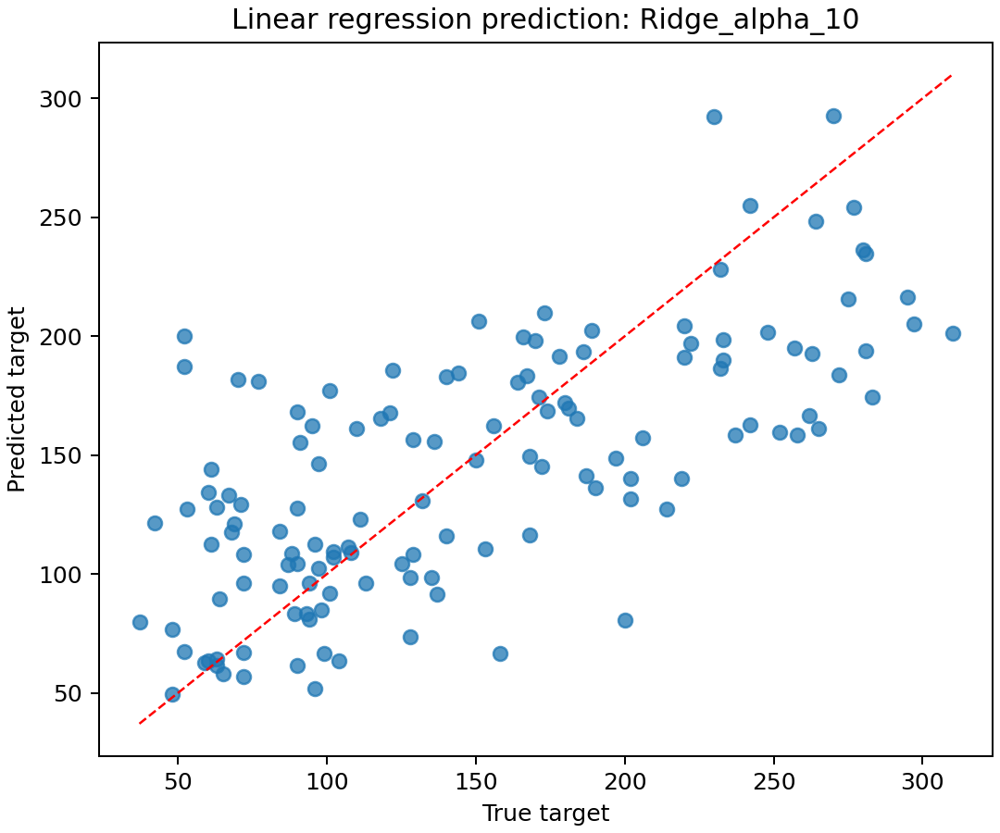

# 实验一：线性回归与岭回归实验报告

## 一、实验目的

本实验要求掌握线性回归和岭回归的基本原理，能够编写程序实现回归模型，并利用模型完成连续值预测任务。实验重点包括最小二乘目标函数、闭式解求解、正则化对模型稳定性的影响，以及回归评价指标的计算。

## 二、实验环境

- 操作系统：macOS
- Python：3.10 及以上，本机验证使用 `/Volumes/Work/opt/anaconda3/bin/python3`
- 主要依赖：numpy、scikit-learn、pandas、matplotlib
- 源码目录：`源码/`
- 环境文件：`源码/environment.yml`

运行命令：

```bash
cd /Volumes/Work/学习/作业/机器学习/结果/实验报告/实验一线性回归/源码
python run_experiment.py --output-dir outputs
```

## 三、实验数据

由于原实验 PDF 只给出参考链接，没有随目录提供具体回归数据，本实验使用 sklearn 自带 Diabetes 回归数据集。该数据集无需联网即可加载，包含 442 个样本、10 个数值特征，目标变量为疾病进展程度，适合作为线性回归应用问题。

## 四、方法原理

设训练集特征矩阵为 \(X\in R^{m\times d}\)，目标值为 \(y\)。普通最小二乘回归通过最小化平方误差学习参数：

$$
\min_w \|Xw-y\|_2^2
$$

岭回归在平方误差基础上加入 \(L_2\) 正则项：

$$
\min_w \|Xw-y\|_2^2+\alpha\|w\|_2^2
$$

其中 \(\alpha\) 控制正则强度。程序中使用带截距项的闭式解进行求解，并比较普通最小二乘与不同 \(\alpha\) 参数的岭回归模型。

## 五、实验步骤

1. 加载 Diabetes 数据集并划分训练集、测试集；
2. 对特征进行标准化处理；
3. 分别训练 OLS、Ridge alpha=0.1、Ridge alpha=1、Ridge alpha=10；
4. 在测试集上计算 MSE、RMSE、MAE、R2；
5. 绘制预测散点图和岭回归系数路径图；
6. 将指标保存到 `源码/outputs/linear_regression_metrics.csv`。

## 六、实验结果

| 模型 | MSE | RMSE | MAE | R2 |
|---|---:|---:|---:|---:|
| OLS_closed_form | 2821.7510 | 53.1202 | 41.9194 | 0.4773 |
| Ridge_alpha_0.1 | 2821.4028 | 53.1169 | 41.9140 | 0.4774 |
| Ridge_alpha_1 | 2819.9820 | 53.1035 | 41.8784 | 0.4776 |
| Ridge_alpha_10 | 2817.4911 | 53.0800 | 41.8567 | 0.4781 |

预测散点图：



岭回归系数路径：


## 七、结果分析

从实验结果看，普通最小二乘模型的测试 R2 为 0.4773；加入岭回归正则后，模型表现略有提升，其中 \(\alpha=10\) 时 R2 达到 0.4781，MSE 也最低。说明在该小规模医学回归数据上，适度 \(L_2\) 正则化可以压缩参数、降低模型方差，使测试集预测更稳定。

## 八、文件说明

- 源码入口：`源码/run_experiment.py`
- 核心实现：`源码/src/linear_regression_lab.py`
- 公共工具：`源码/src/common.py`
- 指标文件：`源码/outputs/linear_regression_metrics.csv`
- 图像目录：`源码/outputs/figures/`

## 九、结论

本实验完成了线性回归和岭回归的闭式解实现，并在 Diabetes 数据集上验证了模型效果。实验表明，岭回归通过正则化约束参数规模，能够在一定程度上提升模型泛化能力。
