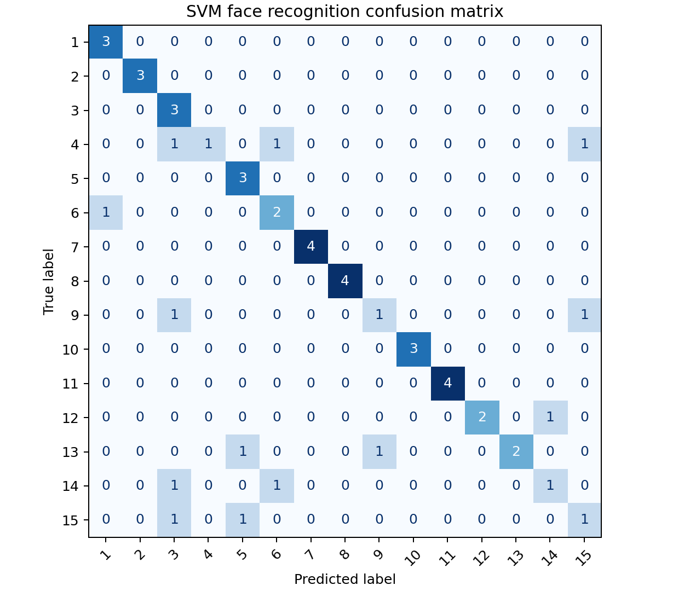

# 实验三：SVM 支持向量机人脸识别实验报告

## 一、实验目的

本实验要求掌握支持向量机在图像分类中的应用流程，能够完成高维图像数据预处理、特征降维、参数搜索、模型训练和预测评价。

## 二、实验环境

- 操作系统：macOS
- Python：3.10 及以上，本机验证使用 `/Volumes/Work/opt/anaconda3/bin/python3`
- 主要依赖：numpy、scipy、scikit-learn、pandas、matplotlib
- 源码目录：`源码/`
- 环境文件：`源码/environment.yml`

运行命令：

```bash
cd /Volumes/Work/学习/作业/机器学习/结果/实验报告/实验三SVM人脸识别/源码
python run_experiment.py \
  --experiment-root /Volumes/Work/学习/作业/机器学习/实验 \
  --output-dir outputs
```

## 三、实验数据

原参考材料使用 `fetch_lfw_people` 在线获取 LFW 人脸数据集。为保证实验离线可复现，本实验使用本地给定的 Yale 人脸数据集，路径为：

```text
实验/第四次实验-神经网络/第四次实验-神经网络/datasets/Yale.mat
```

该数据集包含 165 个样本、1024 个像素特征和 15 类人脸。

## 四、方法原理

支持向量机通过最大化分类间隔构造分类超平面。对于非线性可分问题，RBF 核能够将样本映射到高维特征空间，从而学习更复杂的分类边界。由于人脸图像原始像素维度较高，实验先使用 PCA 提取低维特征脸，再训练 RBF 核 SVM。

## 五、实验步骤

1. 读取 Yale 人脸数据并将像素值归一化；
2. 按 7:3 分层划分训练集和测试集；
3. 使用 PCA 提取 50 维特征；
4. 使用 RBF 核 SVM 建立分类器；
5. 通过 3 折网格搜索选择 \(C\) 和 \(\gamma\)；
6. 在测试集上计算准确率、分类报告和混淆矩阵；
7. 绘制预测样例图。

## 六、实验结果

| 数据集 | PCA 维数 | 最优参数 | 交叉验证 ACC | 测试 ACC |
|---|---:|---|---:|---:|
| Yale | 50 | `{'svc__C': 10, 'svc__gamma': 0.001}` | 0.8176 | 0.7400 |

混淆矩阵：



预测样例：


## 七、结果分析

SVM 在 Yale 小样本人脸数据上取得 0.74 的测试准确率。由于每个类别样本数量有限，训练集规模较小，模型容易受到姿态、光照和个体差异影响。PCA 降维减少了原始像素空间的噪声和冗余，有助于降低计算成本，也能缓解高维小样本条件下的过拟合问题。

## 八、文件说明

- 源码入口：`源码/run_experiment.py`
- 核心实现：`源码/src/svm_face_lab.py`
- 公共工具：`源码/src/common.py`
- 指标文件：`源码/outputs/svm_face_metrics.csv`
- 分类报告：`源码/outputs/svm_face_classification_report.txt`
- 图像目录：`源码/outputs/figures/`

## 九、结论

本实验完成了基于 PCA 和 RBF 核 SVM 的人脸识别流程。实验说明，在高维图像分类任务中，合理的降维和参数搜索能够提升支持向量机的实用性。
