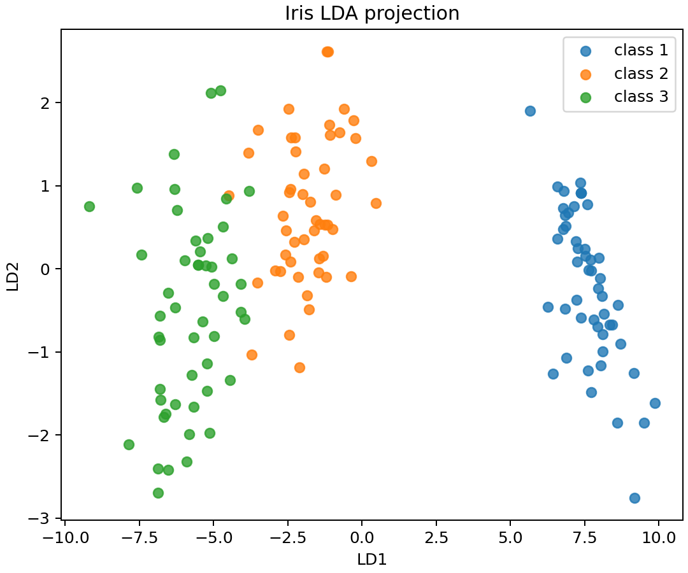
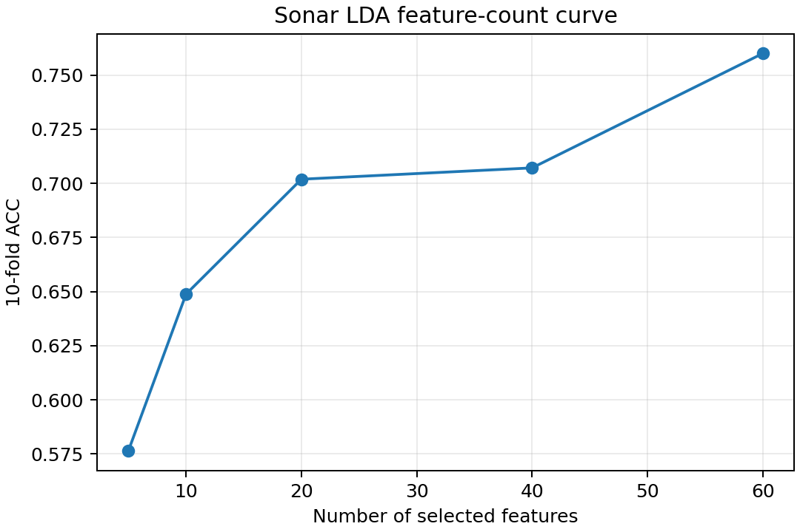

# 实验二：Fisher 线性判别分析 LDA 实验报告

## 一、实验目的

本实验要求掌握 Fisher 线性判别分析的基本思想，理解类内散布矩阵、类间散布矩阵和判别投影方向，并使用 LDA 完成 Iris 与 Sonar 数据集分类任务。

## 二、实验环境

- 操作系统：macOS
- Python：3.10 及以上，本机验证使用 `/Volumes/Work/opt/anaconda3/bin/python3`
- 主要依赖：numpy、scipy、scikit-learn、pandas、matplotlib
- 源码目录：`源码/`
- 环境文件：`源码/environment.yml`

运行命令：

```bash
cd /Volumes/Work/学习/作业/机器学习/结果/实验报告/实验二LDA/源码
python run_experiment.py \
  --experiment-root /Volumes/Work/学习/作业/机器学习/实验 \
  --output-dir outputs
```

## 三、实验数据

实验使用原始实验目录中的两个 `.mat` 数据文件：

- Iris：150 个样本，4 个特征，3 类；
- Sonar：208 个样本，60 个特征，2 类。

两个数据文件的类别标签均位于第一列，程序读取后将第一列作为标签，其余列作为特征。

## 四、方法原理

LDA 的核心思想是寻找一个投影方向，使投影后同类样本尽可能接近，不同类别样本尽可能分离。对于二分类 Fisher 判别，投影方向可写为：

$$
w=S_w^{-1}(m_1-m_2)
$$

其中 \(S_w\) 是类内散布矩阵，\(m_1,m_2\) 是两类样本均值。实验中对 Iris 使用 sklearn 多类 LDA，对 Sonar 同时使用 sklearn LDA 和自定义二分类 Fisher LDA 进行比较。

## 五、实验步骤

1. 加载 Iris 和 Sonar 数据；
2. 对特征进行标准化；
3. 使用 7:3 留出法、10 折交叉验证和留一法评价 sklearn LDA；
4. 在 Sonar 数据集上实现自定义 Fisher LDA 并进行 10 折交叉验证；
5. 比较 Sonar 使用不同特征数量时的分类准确率；
6. 绘制 Iris LDA 投影图和 Sonar 特征数量曲线。

## 六、实验结果

| 数据集 | 方法 | ACC |
|---|---|---:|
| Iris | sklearn_LDA_holdout_7_3 | 0.9778 |
| Iris | sklearn_LDA_10_fold | 0.9800 |
| Iris | sklearn_LDA_leave_one_out | 0.9800 |
| Sonar | sklearn_LDA_holdout_7_3 | 0.8095 |
| Sonar | sklearn_LDA_10_fold | 0.7600 |
| Sonar | sklearn_LDA_leave_one_out | 0.7548 |
| Sonar | custom_Fisher_LDA_10_fold | 0.7550 |

Sonar 特征数量影响：

| 特征数 | 10 折 ACC |
|---:|---:|
| 5 | 0.5764 |
| 10 | 0.6488 |
| 20 | 0.7019 |
| 40 | 0.7071 |
| 60 | 0.7600 |

Iris LDA 投影：



Sonar 特征数量曲线：



## 七、结果分析

Iris 数据的类别分布较清晰，LDA 能够有效找到低维判别方向，因此 10 折交叉验证和留一法准确率均达到 0.98。Sonar 数据维度较高、类别边界更复杂，10 折准确率约为 0.76。随着使用特征数增加，Sonar 分类准确率总体上升，说明更多声呐频段特征能够提供有效判别信息。

自定义 Fisher LDA 在 Sonar 上的 10 折准确率为 0.7550，与 sklearn LDA 的 0.7600 接近，说明手写实现能够正确反映 Fisher 判别思想。

## 八、文件说明

- 源码入口：`源码/run_experiment.py`
- 核心实现：`源码/src/lda_lab.py`
- 公共工具：`源码/src/common.py`
- 指标文件：`源码/outputs/lda_metrics.csv`
- 特征曲线：`源码/outputs/lda_sonar_feature_curve.csv`
- 图像目录：`源码/outputs/figures/`

## 九、结论

本实验完成了 Fisher 线性判别分析的建模、实现和评价。实验结果表明，LDA 适合类间线性可分程度较高的数据，在 Iris 上表现稳定；对于 Sonar 这类高维二分类数据，特征数量和数据复杂度会显著影响分类效果。
