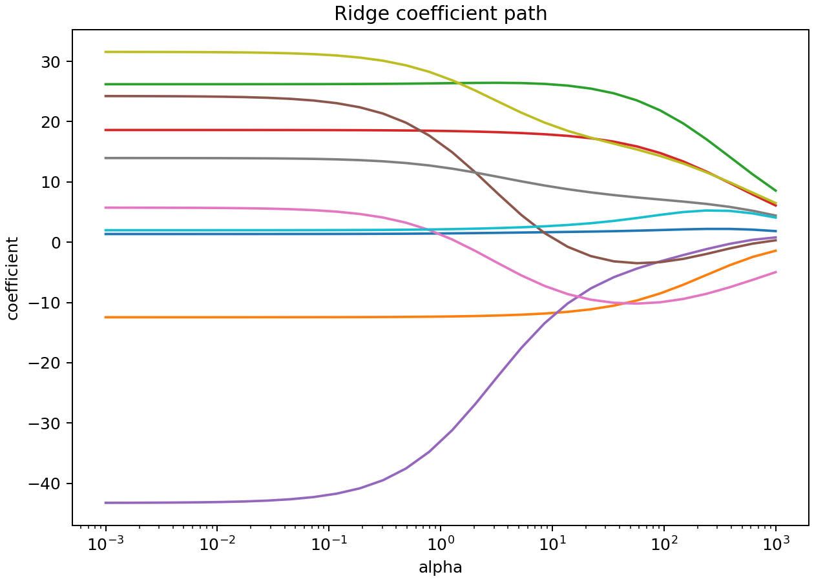
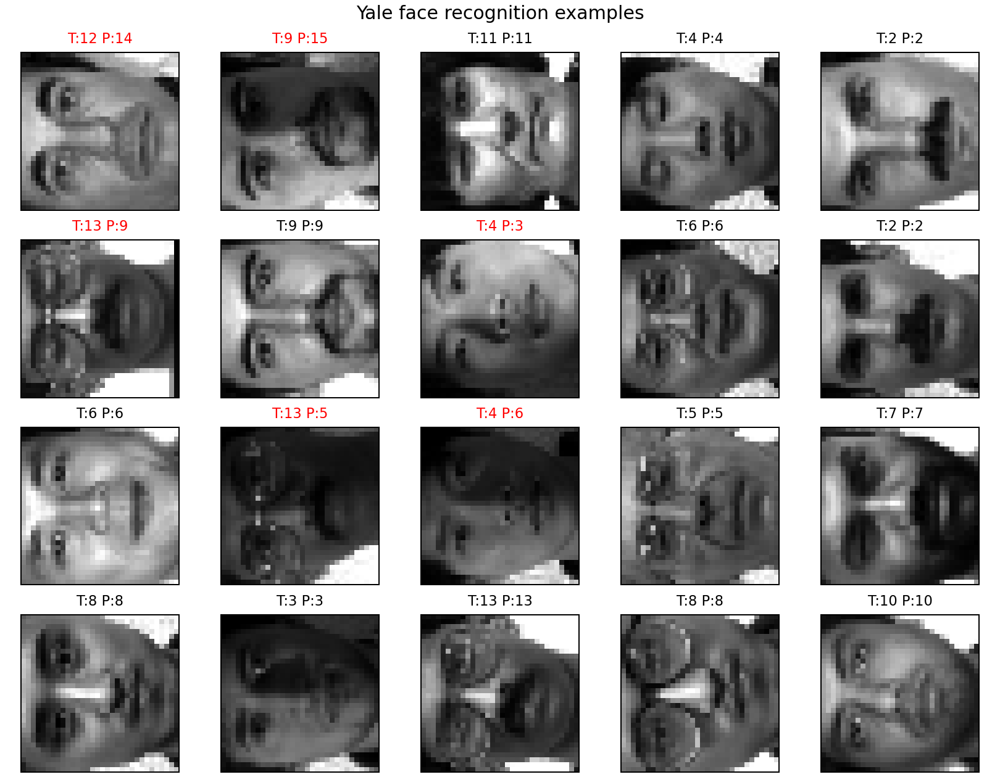
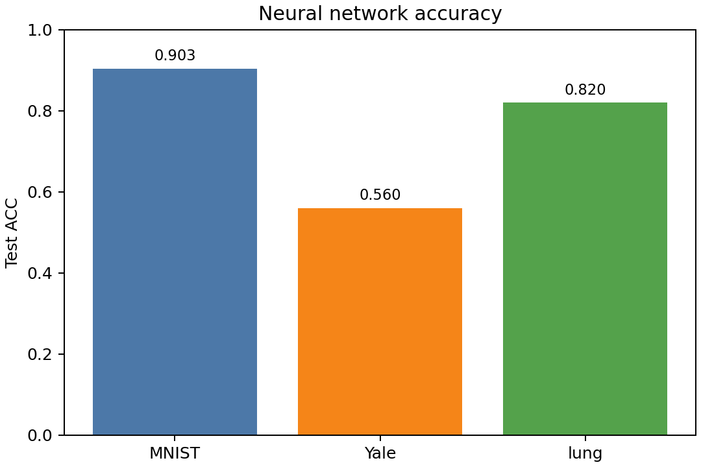
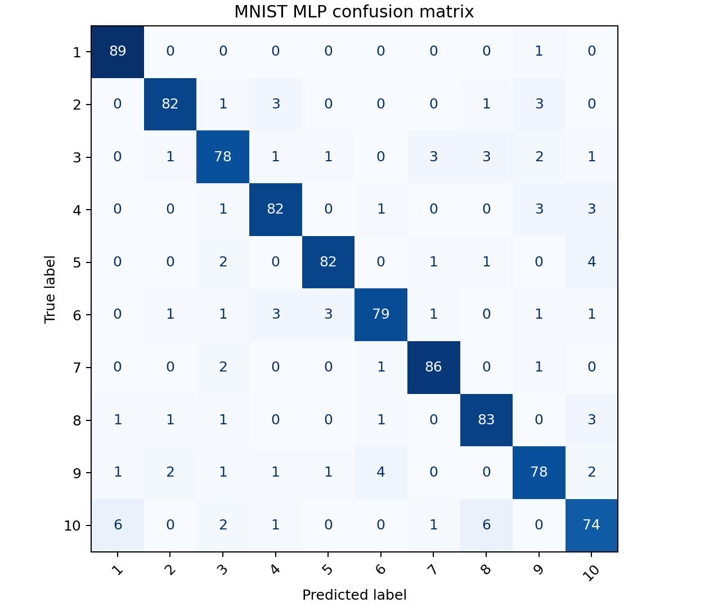
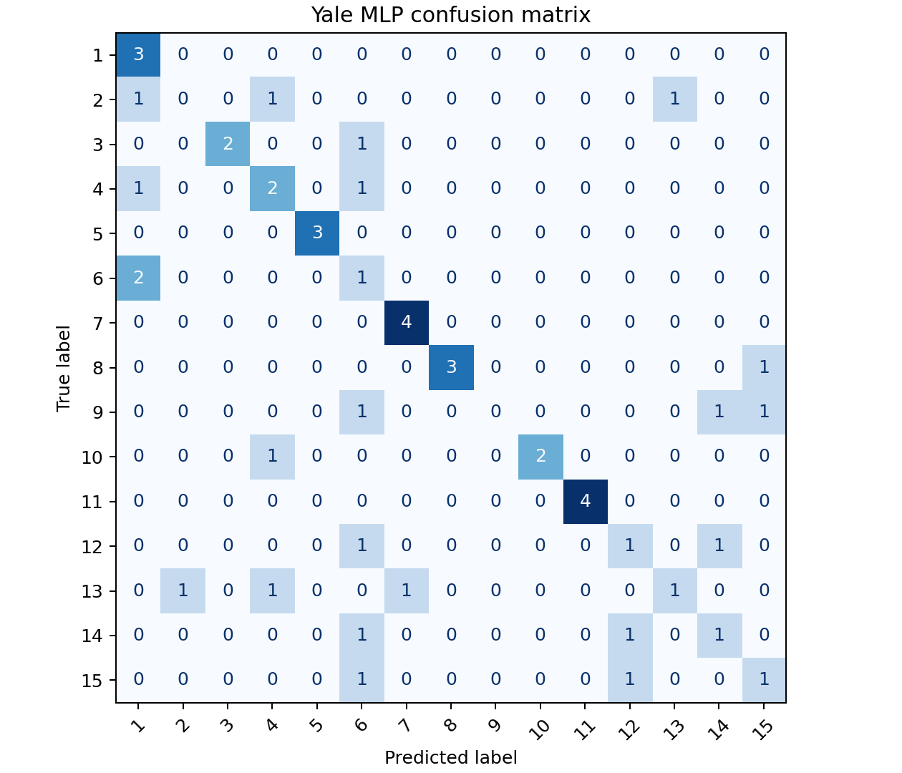
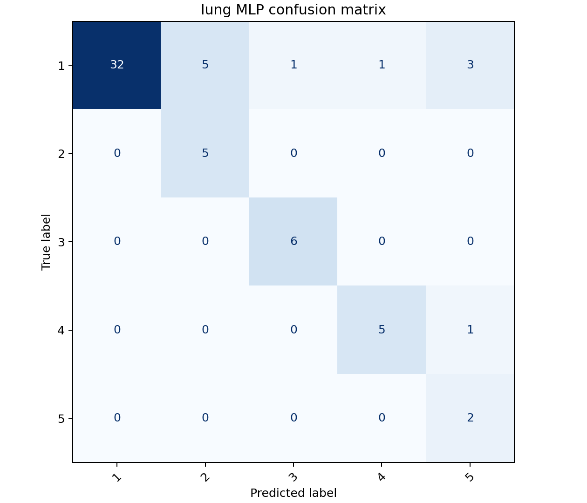

# 机器学习四次实验报告

## 一、实验概述

本报告完成 `/Volumes/Work/学习/作业/机器学习/实验` 目录下的四次实验：线性回归、Fisher 线性判别分析、支持向量机人脸识别和全连接神经网络分类器。实验源码统一放在 `源码/` 中，所有程序均可通过 `run_all_experiments.py` 一键运行，输出结果保存在 `源码/outputs/`。

## 二、实验环境

- 操作系统：macOS
- Python：3.10 及以上，本机验证使用 `/Volumes/Work/opt/anaconda3/bin/python3`
- 主要依赖：numpy、scipy、scikit-learn、pandas、matplotlib
- 环境文件：`源码/environment.yml`

运行命令：

```bash
cd /Volumes/Work/学习/作业/机器学习/结果/实验报告/源码
python run_all_experiments.py \
  --experiment-root /Volumes/Work/学习/作业/机器学习/实验 \
  --output-dir outputs
```

## 三、实验一：线性回归与岭回归

### 1. 实验目的

掌握线性回归和岭回归的基本原理，能够编写程序实现回归模型，并利用模型解决实际连续值预测问题。

### 2. 方法

设训练集为 \(X\in R^{m\times d}\)，目标值为 \(y\)。普通最小二乘回归最小化平方误差：

$$
\min_w \|Xw-y\|_2^2
$$

岭回归在目标函数中加入 \(L_2\) 正则项：

$$
\min_w \|Xw-y\|_2^2+\alpha\|w\|_2^2
$$

程序中实现了闭式解，并比较了 OLS 与不同正则参数的岭回归。由于原实验 PDF 只给出参考链接，没有随目录提供具体回归数据，本实验使用 sklearn 自带 Diabetes 回归数据集，保证无需联网即可复现。

### 3. 实验结果

| 模型 | MSE | RMSE | MAE | R2 |
|---|---:|---:|---:|---:|
| OLS_closed_form | 2821.7510 | 53.1202 | 41.9194 | 0.4773 |
| Ridge_alpha_0.1 | 2821.4028 | 53.1169 | 41.9140 | 0.4774 |
| Ridge_alpha_1 | 2819.9820 | 53.1035 | 41.8784 | 0.4776 |
| Ridge_alpha_10 | 2817.4911 | 53.0800 | 41.8567 | 0.4781 |

结果文件：`源码/outputs/linear_regression_metrics.csv`

图像文件：




### 4. 分析

在 Diabetes 数据集上，岭回归相对普通最小二乘有轻微提升。随着 \(\alpha\) 增大，模型系数被压缩，泛化误差略有下降，说明正则项可以缓解线性模型在小样本数据上的方差问题。

## 四、实验二：Fisher 线性判别分析 LDA

### 1. 实验目的

掌握 Fisher 线性判别分析的基本思想，理解类内离散度和类间离散度，并利用 LDA 对 Iris 和 Sonar 数据集进行分类。

### 2. 数据集

- Iris：150 个样本，4 个特征，3 类；
- Sonar：208 个样本，60 个特征，2 类。

两个 `.mat` 文件的类别标签均位于第一列，程序读取时已按该结构处理。

### 3. 方法

LDA 的目标是寻找投影方向，使投影后类间距离尽可能大、类内散布尽可能小。二分类 Fisher 判别方向可写为：

$$
w=S_w^{-1}(m_1-m_2)
$$

其中 \(S_w\) 为类内散布矩阵，\(m_1,m_2\) 为两类均值。实验中对 Iris 使用 sklearn 的多类 LDA，对 Sonar 同时实现了自定义二分类 Fisher LDA，并使用留出法、10 折交叉验证和留一法评价。

### 4. 实验结果

| 数据集 | 方法 | ACC |
|---|---|---:|
| Iris | sklearn_LDA_holdout_7_3 | 0.9778 |
| Iris | sklearn_LDA_10_fold | 0.9800 |
| Iris | sklearn_LDA_leave_one_out | 0.9800 |
| Sonar | sklearn_LDA_holdout_7_3 | 0.8095 |
| Sonar | sklearn_LDA_10_fold | 0.7600 |
| Sonar | sklearn_LDA_leave_one_out | 0.7548 |
| Sonar | custom_Fisher_LDA_10_fold | 0.7550 |

Sonar 特征数影响：

| 特征数 | 10 折 ACC |
|---:|---:|
| 5 | 0.5764 |
| 10 | 0.6488 |
| 20 | 0.7019 |
| 40 | 0.7071 |
| 60 | 0.7600 |

结果文件：`源码/outputs/lda_metrics.csv`、`源码/outputs/lda_sonar_feature_curve.csv`

图像文件：


### 5. 分析

Iris 数据类间分离明显，因此 LDA 分类准确率接近 0.98。Sonar 数据维度更高、样本更复杂，10 折准确率约为 0.76。随着使用特征数增加，Sonar 的分类效果总体提升，说明更多声呐频段特征能够提供有效判别信息。

## 五、实验三：SVM 支持向量机人脸识别

### 1. 实验目的

掌握支持向量机在图像分类中的应用流程，能够完成数据划分、特征降维、参数搜索、模型训练和预测评价。

### 2. 数据集与方法

原参考材料使用 `fetch_lfw_people` 在线获取 LFW 人脸数据集。为保证实验离线可复现，本实验使用本地给定的 Yale 人脸数据集，数据位于神经网络实验目录的 `datasets/Yale.mat`。该数据集包含 165 个样本、1024 个特征、15 类人脸。

方法流程：

1. 将像素值归一化；
2. 按 7:3 分层划分训练集和测试集；
3. 使用 PCA 提取 50 维特征脸；
4. 使用 RBF 核 SVM 进行分类；
5. 通过 3 折网格搜索选择 \(C\) 和 \(\gamma\)。

### 3. 实验结果

| 数据集 | PCA 维数 | 最优参数 | 交叉验证 ACC | 测试 ACC |
|---|---:|---|---:|---:|
| Yale | 50 | `{'svc__C': 10, 'svc__gamma': 0.001}` | 0.8176 | 0.7400 |

结果文件：`源码/outputs/svm_face_metrics.csv`、`源码/outputs/svm_face_classification_report.txt`

图像文件：




### 4. 分析

SVM 在小样本人脸数据上取得 0.74 的测试准确率。由于 Yale 每类样本较少，训练集规模有限，模型对姿态、光照和个体差异较敏感。PCA 降维既降低了计算成本，也减少了像素维度过高导致的过拟合风险。

## 六、实验四：全连接神经网络分类器

### 1. 实验目的

掌握全连接神经网络分类器的训练与测试方法，并使用 ACC 指标评价分类结果。

### 2. 数据集

| 数据集 | 样本数 | 维度 | 类数 | 数据类型 |
|---|---:|---:|---:|---|
| MNIST | 3000 | 784 | 10 | 手写体数字 |
| Yale | 165 | 1024 | 15 | 人脸图像 |
| lung | 203 | 3312 | 5 | 生物数据 |

### 3. 方法

实验使用单隐藏层全连接神经网络，隐藏层采用 ReLU 激活，输出层使用多分类交叉熵目标。训练时对特征进行标准化，并采用 Adam 优化器和早停策略。

### 4. 实验结果

| 数据集 | 隐藏层 | 迭代次数 | loss | 测试 ACC |
|---|---|---:|---:|---:|
| MNIST | (128,) | 21 | 0.0062 | 0.9033 |
| Yale | (64,) | 21 | 0.0152 | 0.5600 |
| lung | (48,) | 14 | 0.0003 | 0.8197 |

结果文件：`源码/outputs/neural_network_metrics.csv`

图像文件：









### 5. 分析

神经网络在 MNIST 上取得 0.9033 的测试准确率，说明全连接网络能够较好捕捉数字图像的判别结构。Yale 数据集样本数少、类别多，因此测试准确率低于 MNIST。lung 数据虽然维度高，但类别结构较明显，取得 0.8197 的准确率。

## 七、总结

四次实验分别覆盖了回归、线性判别、核方法和神经网络四类机器学习方法。线性回归实验说明正则化能提升模型稳定性；LDA 实验展示了监督降维和分类的关系；SVM 人脸识别实验体现了 PCA 与核分类器结合处理高维图像的常见流程；神经网络实验验证了全连接分类器在图像和生物数据上的适用性。所有实验均已生成可复现实验源码、指标 CSV 和图像结果。

## 八、文件说明

- 源码目录：`源码/`
- 一键运行脚本：`源码/run_all_experiments.py`
- 运行环境：`源码/environment.yml`
- 输出目录：`源码/outputs/`
- 汇总结果：`源码/outputs/summary.json`
